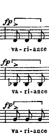

I'm a methodologist interested in causal inference, machine learning, and selective inference. 

In September, I'm joining Princeton as a Postdoc in Politics, Statistics and Machine Learning working with Arthur Spirling. I'm currently a PhD candidate at UC Berkeley. 

I'm advised by Thad Dunning, and my dissertation committee members are Kirk Bansak, Erin Hartman, Avi Feller, and Peng Ding. 

I'm British and Moroccan, and a lifelong chorister. 

My CV is [here](files/AB_CV.pdf).

